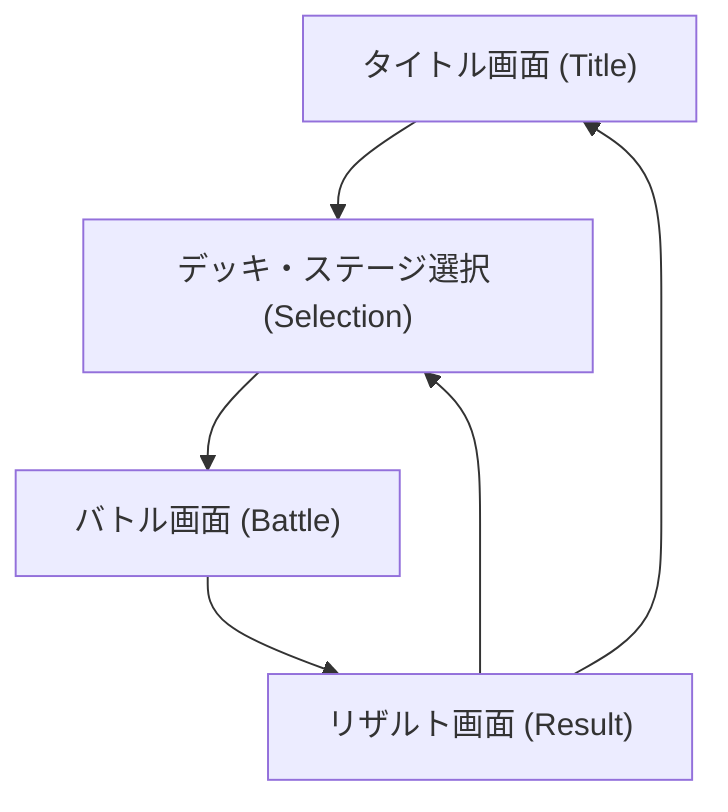

# 画面遷移図 (Screen Flow)

## 1. 全体フロー
以下の図は、ゲーム全体の画面遷移を定義したものです。

## 2. 各画面の設計ルール
- **Title**: 全画面。タップのみで次へ。
- **Selection**: 5x5グリッド。スクロールなし。
- **Battle**: 比率 38:62。レスポンシブ。
- **Result**: オーバーレイ表示（背景を暗転）。

## 3. モバイル対応（将来）
- **セーフエリア**: 画面端から20pxの余白を基本とし、ノッチを避ける。
- **アンカー**: UI要素は基本的に「四隅」または「中央」にアンカーを打つ。
